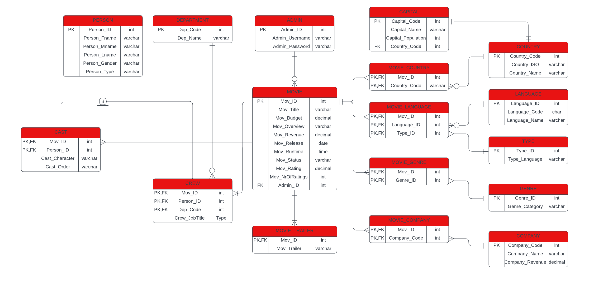

# Cinematrix
Cinematrix is a IMDb lookalike application where you can check movies and trailers.
## Main Functionalities
The application has a lot of movies to choose from and main functionalities are divided into two groups: 
1. User
- Login/Register
- Search movies by their title
- Filter movies based on their genre
- Review all movie details
- Watch trailer
2. Administrator
- Retrieve all movies' and users' information
- Add/Edit/Delete movies
- Edit/Delete users
- See all user suggestions for movies
## Features
- Functionalitis were developed in Java 
- Design was developed in XML
- Communication between classes was achieved using controllers
## Database
- SQL Server was used as DBMS

## Contributing
For changes and updates in the code, you can open an issue. 

You are very welcome.
